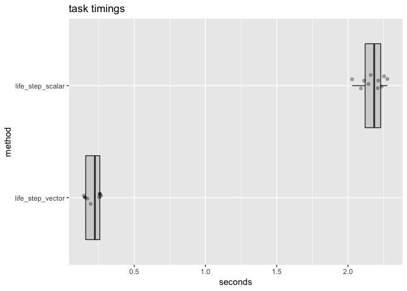

Comparing Vector Versus scalar Implementations of Conway's Game of Life
================

``` r
library("FastBaseR")
library("microbenchmark")
library("WVPlots")

life_step_scalar <- function(d) {
  nrow <- dim(d)[[1]]
  ncol <- dim(d)[[2]]
  dnext <- matrix(data = FALSE, nrow = nrow, ncol = ncol)
  for(i in seq_len(nrow)) {
    for(j in seq_len(ncol)) {
      pop <- 0
      if(i>1) {
        if(j>1) {
          pop <- pop + d[i-1, j-1]
        }
        pop <- pop + d[i-1, j]
        if(j<ncol) {
          pop <- pop + d[i-1, j+1]
        }
      }
      if(j>1) {
        pop <- pop + d[i, j-1]
      }
      if(j<ncol) {
        pop <- pop + d[i, j+1]
      }
      if(i<nrow) {
        if(j>1) {
          pop <- pop + d[i+1, j-1]
        }
        pop <- pop + d[i+1, j]
        if(j<ncol) {
          pop <- pop + d[i+1, j+1]
        }
      }
      dnext[i,j] <- (pop==3) || (d[i,j] & (pop>=2) & (pop<=3))
    }
  }
  dnext
}

set.seed(2352)
grid_size = 1000
d <- matrix(data = sample(c(TRUE, FALSE), grid_size*grid_size, replace = TRUE), 
            nrow = grid_size, ncol = grid_size)
```

``` r
d_next_scalar <- life_step_scalar(d)
d_next_vector <- life_step(d)
if(!isTRUE(all.equal(d_next_scalar, d_next_vector))) {
  stop("mismatch")
}
```

``` r
timing <- microbenchmark(
  life_step_scalar = life_step_scalar(d),
  life_step_vector = life_step(d),
  times = 10L)
```

``` r
print(timing)
```

    ## Unit: milliseconds
    ##              expr      min        lq      mean    median        uq
    ##  life_step_scalar 2267.666 2398.6398 2667.4922 2582.4812 2982.7465
    ##  life_step_vector  136.746  148.9997  214.6675  165.7251  293.2285
    ##        max neval cld
    ##  3259.3728    10   b
    ##   366.2386    10  a

``` r
tm <- data.frame(timing)
tm$method <- as.factor(tm$expr)
tm$seconds <- tm$time/1e+9
tm$method <- reorder(tm$method, tm$seconds)
ScatterBoxPlotH(tm, "seconds", "method",  "task timings")
```


