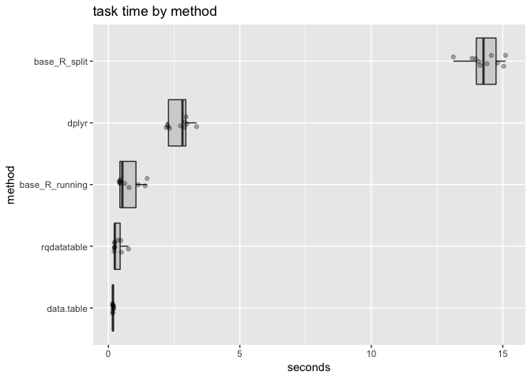

grouped\_sum\_timing.Rmd
================

Example using [`FastBaseR`](https://github.com/WinVector/FastBaseR).

``` r
library("dplyr")
```

    ## 
    ## Attaching package: 'dplyr'

    ## The following objects are masked from 'package:stats':
    ## 
    ##     filter, lag

    ## The following objects are masked from 'package:base':
    ## 
    ##     intersect, setdiff, setequal, union

``` r
packageVersion("dplyr")
```

    ## [1] '0.7.7'

``` r
library("data.table")
```

    ## 
    ## Attaching package: 'data.table'

    ## The following objects are masked from 'package:dplyr':
    ## 
    ##     between, first, last

``` r
packageVersion("data.table")
```

    ## [1] '1.11.8'

``` r
library("microbenchmark")
library("WVPlots")
library("FastBaseR")
library("rqdatatable")
```

    ## Loading required package: rquery

``` r
f_base_R_split <- function(data) {
  # first sort the data
  order_index <- with(data, 
                      order(x, y, decreasing = TRUE))
  odata <- data[order_index, , drop = FALSE]
  # now split into groups
  data_list <- split(odata, -odata$x)
  # apply the cumsum to each group
  data_list <- lapply(
    data_list,
    function(di) {
      di$running_y_sum <- cumsum(di$y)
      di
    })
  # put the results back to together
  odata <- do.call(rbind, data_list)
  rownames(odata) <- NULL
  odata
}

f_base_R_running <- function(data) {
  # first sort the data
  order_index <- with(data, order(x, y, decreasing = TRUE))
  odata <- data[order_index, , drop = FALSE]
  rownames(odata) <- NULL
  first_indices <- mark_first_in_each_group(odata, "x")
  odata$running_y_sum <- cumsum_g(odata$y, first_indices)
  odata
}


f_data.table <- function(data) {
  data_data.table <- as.data.table(data)
  
  # sort data
  setorderv(data_data.table, c("x", "y"), order = -1L)
  # apply operation in each x-defined group
  data_data.table[ , running_y_sum := cumsum(y), by = "x"]
  data_data.table[]
}

f_dplyr <- function(data) {
  data %>%
    arrange(., desc(x), desc(y)) %>%
    group_by(., x) %>%
    mutate(., running_y_sum = cumsum(y)) %>%
    ungroup(.)
}

f_rqdatatable <- function(data) {
  data %.>%
    extend_nse(data,
               running_y_sum = cumsum(y),
               partitionby = "x",
               orderby = "y",
               reverse = "y") %.>%
    orderby(.,
            cols = c("x", "y", "running_y_sum"),
            reverse = c("x", "y", "running_y_sum"))
}

data <- wrapr::build_frame(
   "x", "y" |
   1  , 1   |
   0  , 0   |
   1  , 0   |
   0  , 1   |
   0  , 0   |
   1  , 1   )

sort_vi <- function(vi, expected_cols) {
  vi <- data.frame(vi)
  if(is.null(expected_cols)) {
    expected_cols <- sort(colnames(vi))
  } else {
    if(!isTRUE(all.equal(sort(colnames(vi)), 
                         sort(expected_cols)))) {
      stop("colnames not as expected")
    }
  }
  vi <- vi[ , expected_cols]
  vi <- vi[wrapr::orderv(vi), , drop = FALSE]
  rownames(vi) <- NULL
  vi
}

my_check <- function(values) {
  v1 <- sort_vi(values[[1]], NULL)
  all(vapply(values[-1], 
             function(x) {
               isTRUE(all.equal(v1, sort_vi(x, colnames(v1))))
             },
             logical(1)))
}

lst <- list( 
  base_R_split = f_base_R_split(data),
  base_R_running = f_base_R_running(data),
  data.table = f_data.table(data),
  dplyr = f_dplyr(data),
  rqdatatable = f_rqdatatable(data))

print(lst)
```

    ## $base_R_split
    ##   x y running_y_sum
    ## 1 1 1             1
    ## 2 1 1             2
    ## 3 1 0             2
    ## 4 0 1             1
    ## 5 0 0             1
    ## 6 0 0             1
    ## 
    ## $base_R_running
    ##   x y running_y_sum
    ## 1 1 1             1
    ## 2 1 1             2
    ## 3 1 0             2
    ## 4 0 1             1
    ## 5 0 0             1
    ## 6 0 0             1
    ## 
    ## $data.table
    ##    x y running_y_sum
    ## 1: 1 1             1
    ## 2: 1 1             2
    ## 3: 1 0             2
    ## 4: 0 1             1
    ## 5: 0 0             1
    ## 6: 0 0             1
    ## 
    ## $dplyr
    ## # A tibble: 6 x 3
    ##       x     y running_y_sum
    ##   <dbl> <dbl>         <dbl>
    ## 1     1     1             1
    ## 2     1     1             2
    ## 3     1     0             2
    ## 4     0     1             1
    ## 5     0     0             1
    ## 6     0     0             1
    ## 
    ## $rqdatatable
    ##    x y running_y_sum
    ## 1: 1 1             2
    ## 2: 1 1             1
    ## 3: 1 0             2
    ## 4: 0 1             1
    ## 5: 0 0             1
    ## 6: 0 0             1

``` r
my_check(lst)
```

    ## [1] TRUE

``` r
nrow <- 1000000
nsym <- 100000
set.seed(235236)
data <- data.frame(x = sample.int(nsym, nrow, replace = TRUE))
data$y <- rnorm(nrow(data))

lst <- list( 
  base_R_split = f_base_R_split(data),
  base_R_running = f_base_R_running(data),
  data.table = f_data.table(data),
  dplyr = f_dplyr(data),
  qdatatable = f_rqdatatable(data))
my_check(lst)
```

    ## [1] TRUE

``` r
lst <- NULL


timing <- microbenchmark(
  base_R_split = f_base_R_split(data),
  base_R_running = f_base_R_running(data),
  data.table = f_data.table(data),
  dplyr = f_dplyr(data),
  rqdatatable = f_rqdatatable(data),
  times = 10L
)

print(timing)
```

    ## Unit: milliseconds
    ##            expr        min         lq       mean     median         uq
    ##    base_R_split 13121.3400 13962.0558 14304.3326 14266.4050 14802.3283
    ##  base_R_running   406.5448   434.9965   757.3621   532.6069  1135.2956
    ##      data.table   156.3390   162.2644   176.8735   170.0157   194.8812
    ##           dplyr  2200.4221  2269.5243  2687.6506  2817.9205  2956.5787
    ##     rqdatatable   214.4377   228.5414   348.5213   242.8017   472.2641
    ##         max neval  cld
    ##  15106.3294    10    d
    ##   1471.5736    10  b  
    ##    203.8281    10 a   
    ##   3354.0826    10   c 
    ##    762.9988    10 ab

``` r
tm <- as.data.frame(timing)
tm$seconds <- tm$time/1e+9
tm$method <- factor(tm$expr)
tm$method <- reorder(tm$method, tm$seconds)
ScatterBoxPlotH(tm, 
                "seconds", "method", 
                "task time by method")
```


